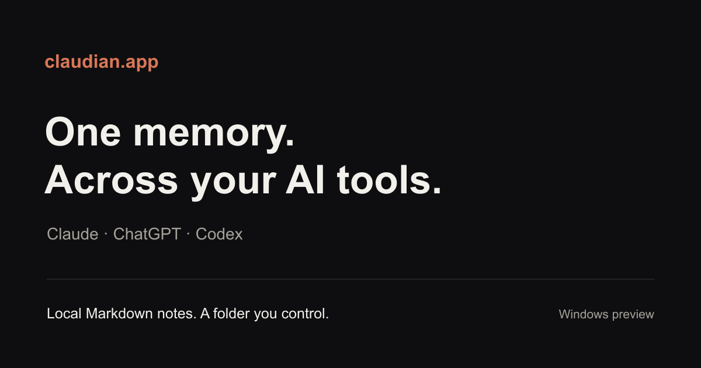

# Claudian.app

**Shared local AI memory for Claude, ChatGPT and Codex.**

Keep useful decisions, corrections and context in Markdown notes on your own computer. Connect supported AI tools to the same memory folder, so a change of tool does not require you to explain everything again.

[Download for Windows](https://github.com/GeneralBobi/claudian-app/releases/latest) · [Documentation](https://claudian.app/docs) · [Website](https://claudian.app) · [Get help](https://github.com/GeneralBobi/claudian-app/issues)

## What it does

- Prepares a new memory folder or connects your existing Obsidian vault.
- Sets up supported AI connections using a shared memory protocol.
- Keeps memory readable and editable as plain Markdown.
- Helps an AI retain useful context and correct outdated notes across conversations.

The exact setup depends on the AI application. Read the [installation guide](https://claudian.app/docs/installation) for the current preview and confirm the connection with a real conversation.

## Get started

1. Download the Windows installer from the [latest release](https://github.com/GeneralBobi/claudian-app/releases/latest).
2. Choose a new note folder or an existing vault.
3. Open **Connections**, choose an AI tool and follow its setup steps.
4. Restart that tool when prompted and test that it can read and update your chosen notes.

Windows 10 or 11. You use your existing AI account; provider requirements vary. Claudian continues running in the system tray when its window is closed.

## Your notes remain yours

Memory lives in a folder you control. A cloud AI provider may receive the context you allow for a request. Local storage does not mean that every connected provider runs locally. See [privacy and boundaries](https://claudian.app/docs/privacy).

## Releases and support

This repository is the public home for downloads, documentation and user support. Development is moving to a closed-source model; previously published source snapshots are still visible in this repository and its history while that transition is planned. Source-code contributions are not accepted here. See [contribution guidelines](.github/CONTRIBUTING.md) for documentation corrections and feedback, and [security reporting](.github/SECURITY.md) for vulnerabilities.

This is an independent project. It is not affiliated with Anthropic, OpenAI, Google, Obsidian or the separately maintained Claudian Obsidian plugin.
